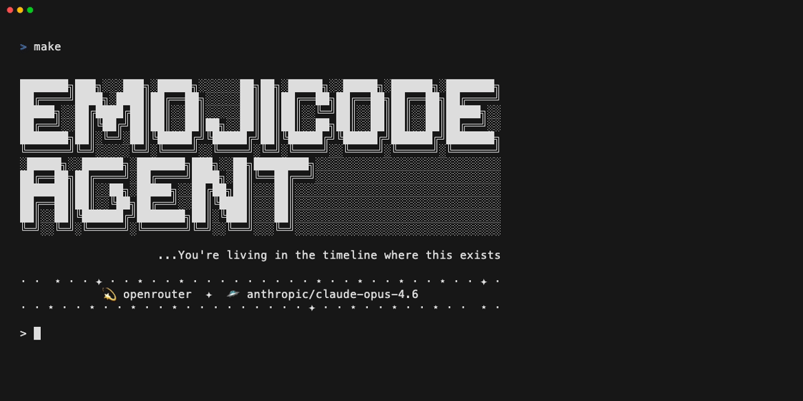
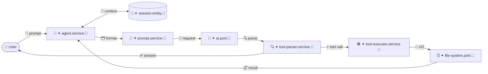

# emojicode agent
[](https://www.emojicode.org/)
[](https://github.com/hxxx64/emojicode-agent/actions/workflows/main-build-test.yml)
[](./LICENSE)

> **Wait -- you're not vibe coding with an ✨emojicode✨ agent?**

An AI coding agent written entirely in [Emojicode](https://www.emojicode.org/).
Give it a prompt, and it reads files, writes code, searches your project, and makes edits --
all through an agentic tool loop powered by your AI provider of choice.

---

## ▶️ Demo



---

## ✨ Features

- 🛠️ **5 Built-in Tools** — `read_file`, `write_file`, `replace_in_file`, `search_files`, `list_files`
- 🔄 **Agentic Tool Loop** — Iterative "Think-Act-Observe" cycle (up to 10 turns)
- 📓 **Session History** — Stateful multi-turn context for messages, tool calls, and results
- 🔌 **Swappable AI Providers** — Support for OpenRouter with an offline mock fallback
- 🏗️ **Clean Architecture** — Strict Hexagonal (Ports & Adapters) pattern with C++ FFI

Check out the **[Documentation](./docs/README.md)** for a deep dive into how it works.

---

## 🚀 Quick Start

Choose your path -- Docker requires no local toolchain, native gives you the full dev experience.

### 🐳 Via Docker

No Emojicode installation needed. Works on any platform including Apple Silicon.

**1. 🔨 Build the image**

```bash
docker build -t emojicode-agent .
```

**2. 🔑 Run against your project**

```bash
docker run -it \
  -e OPENROUTER_API_KEY=sk-or-v1-... \
  -v $(pwd):/workdir \
  emojicode-agent
```

Replace `$(pwd)` with the path to any project you want the agent to work on.
The agent starts up and waits for your prompt.

---

### 🍇 Native

**1. 📦 Install Emojicode**

Follow the guide at [emojicode.org/docs/guides/install](https://www.emojicode.org/docs/guides/install).
Emojicode targets x86_64; on Apple Silicon it runs via Rosetta 2.

**2. 🔑 Set up your AI provider**

```bash
cp .env.example .env
# Add your key: OPENROUTER_API_KEY=sk-or-v1-...
```

**3. ⚡ Build and run**

```bash
make
```

This compiles everything and launches the agent in the `workdir/` directory. Type a prompt and press Enter.
To run against a different project: `make WORKDIR=../my-project`

---

## ⚙️ How It Works



- **🍇 Emojicode** — core logic, protocols, and orchestration across multiple `.🍇` source files
- **📓 Session** — maintains a multi-turn history of messages, tool calls, and results for coherent task execution
- **⚡ C++ FFI** — stdin, file I/O, and HTTP via libcurl bridge the gap to the OS
- **🔄 Tool loop** — the AI calls tools, results feed back as context, and the cycle repeats until it produces a final answer
- **📁 FileSystem** — real-time operations via a hardened C++ layer with path-traversal protection

The agent runs inside the project directory you specify (`WORKDIR`, default `workdir`). All file paths are relative to that root.

---

## 🔌 Providers

AI connectors are swappable -- the agent talks to any backend that implements the connector port.

| Provider                             | Status    | Notes                            |
| ------------------------------------ | --------- | -------------------------------- |
| [OpenRouter](https://openrouter.ai/) | Available | Any model via `OPENROUTER_MODEL` |
| More coming soon                     | Planned   | --                               |

Without a configured provider the agent falls back to a built-in mock adapter for offline testing.

---

## 🗂️ Project Layout

```
src/
├── domain/            # Pure Business Logic (No dependencies)
│   ├── entities/      # Objects with identity (session.entity.🍇)
│   ├── value-objects/ # Immutable data (message.vo.🍇, tool-call.vo.🍇, tool-result.vo.🍇)
│   ├── services/      # Domain logic (prompt.service.🍇, tool-parser.service.🍇)
│   └── ports/         # Protocols/Interfaces (ai.port.🍇, file-system.port.🍇, input.port.🍇, output.port.🍇)
│
├── application/       # Use Cases & Orchestration
│   └── services/      # Orchestrators (agent.service.🍇, tool-executor.service.🍇)
│
├── infrastructure/    # External Implementation Details
│   ├── adapters/      # Concrete implementations (ai/, persistence/, ui/)
│   │   └── *.cpp      # C++ FFI for HTTP, File I/O, and Input
│   └── config/        # Infrastructure-specific config (system-prompt.config.🍇)
│
├── tests/             # Unit and integration tests (main.🍇)
│
└── main.🍇            # Composition Root (Dependency Injection)
```

---

## 📋 Requirements

|              | 🐳 Docker                              | 🍇 Native                             |
| ------------ | ------------------------------------- | ------------------------------------ |
| Runtime      | Docker Desktop                        | Emojicode 1.0 beta 2, Clang, libcurl |
| Platform     | Any (x86_64 emulated via QEMU on ARM) | x86_64 · Apple Silicon via Rosetta 2 |
| Setup effort | Minimal                               | Install Emojicode + Xcode CLI tools  |

---

## 🔧 Configuration

| Variable             | Description                            | Default           |
| -------------------- | -------------------------------------- | ----------------- |
| `OPENROUTER_API_KEY` | Your OpenRouter API key                | _(required)_      |
| `OPENROUTER_MODEL`   | Model identifier on OpenRouter         | `openrouter/free` |
| `OPENROUTER_VERBOSE` | Set to `1` to log HTTP request details | _(off)_           |

Set these in a `.env` file (see [.env.example](.env.example)).

---

## 📚 Documentation

- **[docs/README.md](./docs/README.md)** -- Project documentation
- **[Official Emojicode Documentation](https://www.emojicode.org/docs/)** -- Comprehensive Emojicode language reference (syntax, types, control flow, standard library, and more)
- **[AGENTS.md](./AGENTS.md)** -- Instructions for AI agents contributing to this codebase

---

## 🧪 Testing

The project maintains a rigorous testing suite using the **testtube** library, covering both isolated domain logic and end-to-end agentic loops.

CI runs automatically on every push and pull request via [GitHub Actions](.github/workflows/main-build-test.yml).

### 🐳 Via Docker

```bash
docker build --target builder -t emojicode-agent:builder .
docker run --rm emojicode-agent:builder make test
```

### 🍇 Native

```bash
make test
```

---

## 🤝 Contributing

Contributions are welcome -- feel free to open an issue or a pull request.

Good starting points:

- 🔌 **New AI provider** -- implement the `ai-connector-protocol` and drop it in `src/infrastructure/`
- 🛠️ **New tool** -- add a tool XML handler in `src/application/tool-executor.🍇`
- 🐛 **Bug fix or improvement** -- anything in the agent loop, prompt builder, or tool parser

No strict process -- just explain what you changed and why. 

---

<p align="center">
  <sub>Built with 🍇 · <a href="https://www.emojicode.org/">emojicode.org</a> · <a href="./LICENSE">MIT License</a></sub>
</p>
